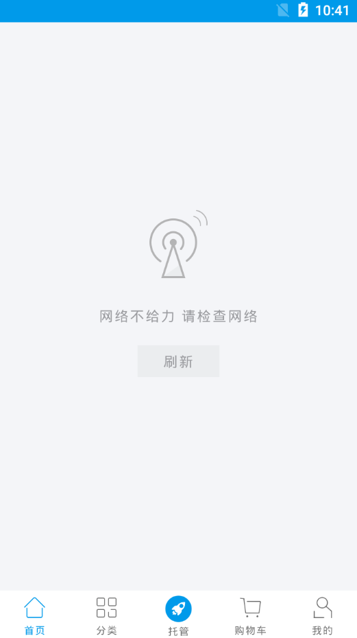

# Android为全局添加View

## 需求
>给所有涉及网络请求Activity和Fragment添加一个断网的页面（以下简称emptyView），并且带有点击刷新功能，界面如图
<br><a href="image/no_net.png"></a>

## 方法
1. 在需要显示emptyView的Activity和Fragment的layout中使用FrameLayout布局包括需要隐藏的内容和emptyView，并且EmptyView要在下方，Visiable设置GONE
>缺点：方法简单，没有难度，除了麻烦就是麻烦，写着麻烦，看着也麻烦

2. 封装一个基本EmptyActivity,重写setContentView()方法，new一个FrameLayout container，add emptyView和通过LayoutInflater得到的View，实例化emptyView中的按钮和点击事件，添加显示的方法。
示例代码
```
public class EmptyActivity extends AppCompatActivity {

    protected Context context;
    private View view404, view;
    private FrameLayout container;
    private Button btnRefresh;

    @Override
    protected void onCreate(@Nullable Bundle savedInstanceState) {
        super.onCreate(savedInstanceState);
        context = this;
    }

    @Override
    public void setContentView(int layoutResID) {
        super.setContentView(getContainer());
        view = LayoutInflater.from(this).inflate(layoutResID, null);
        container.addView(view, 0);
    }

    private View getContainer() {
        container = new FrameLayout(this);
        view404 = LayoutInflater.from(this).inflate(R.layout.view_404, null, false);
        btnRefresh = view404.findViewById(R.id.btn_404_refresh);
        container.addView(view404);
        return container;
    }

    /**
     * 设置404显示状态
     *
     * @param visiable
     */
    protected void set404Visiable(boolean visiable) {
        if (visiable) {
            view404.setVisibility(View.VISIBLE);
        } else {
            view404.setVisibility(View.GONE);
        }
    }

    /**
     * 404刷新数据回调
     *
     * @param listener
     */
    protected void setRefreshListener(View.OnClickListener listener) {
        btnRefresh.setOnClickListener(listener);
    }

}

```
> 缺点：新添加的emptyView是全屏效果的，会遮盖导航栏，UI肯定不会同意的

3. EmptyFragment与EmptyActivity类似，不过需要重写onCreateView方法，需要注意Fragment的容器是Activcity，不需要每次创建一个新的Fragment都添加emptyView
如果在fragment中获取父容器，我还没有一个好的办法，目前能想到的就是通过getActivity().findViewById(R.id.container);这么做就需要固定父容器的id为container，本人不喜欢
> 通过方法2和3的方法可以打开思路，比如添加一个toolbar，还有我采用的方法4。

4. __我所用的方法__：方法2和3思路就是得到一个父容器然后再添加需要展示的view和emptyView，那我就自定义一个父容器，本身包括emptyView并暴露方法，在需要展示emptyView的layout中使用自定的的父容器。代码如下
```
public class NoNetFrameLayout extends FrameLayout {

    private Context context;
    private View view404;
    private Button btnRefresh;

    public NoNetFrameLayout(@NonNull Context context) {
        this(context, null);
    }

    public NoNetFrameLayout(@NonNull Context context, @Nullable AttributeSet attrs) {
        super(context, attrs);
        this.context = context;
        init();
    }

    private void init() {
        view404 = LayoutInflater.from(context).inflate(R.layout.view_404, null, false);
        btnRefresh = view404.findViewById(R.id.btn_404_refresh);
        addView(view404);
    }

    /**
     * 设置404显示状态
     *
     * @param visiable
     */
    public void set404Visiable(boolean visiable) {
        if (visiable) {
            view404.setVisibility(View.VISIBLE);
              bringChildToFront(view404);
        } else {
            view404.setVisibility(View.GONE);
        }
    }

    /**
     * 404刷新数据回调
     *
     * @param listener
     */
    public void setRefreshListener(View.OnClickListener listener) {
        btnRefresh.setOnClickListener(listener);
    }
}

```
#### 注意：
1. emptyView的layout必须要设置一个背景颜色，否则就会显示下面的View
2. 需要显示的view，必须用一个布局包起来，否则就会显示下面的View
>用法很简单就不多介绍了，只要注意以上两点就行，看不懂的可以去看例子中的注释

5. 别人提供的方法：Activity layout中添加emptyView，如果Fragment需要显示emptyView，向Activity发送消息，hide fragment，show emptyView，点击事件通过接口回调
> 个人觉得麻烦，需要fragment和activity来回调用方法，不喜欢

## 总结
* 方法1太麻烦，不推荐
* 方法2和3适合已经完成的项目，改动较少
* 方法4个人觉得适合刚开始的项目，即使已经完成改动也相对简单
* 看个人爱好吧，喜欢什么就用什么，如果有更好办法的小伙伴，欢迎提出啊！